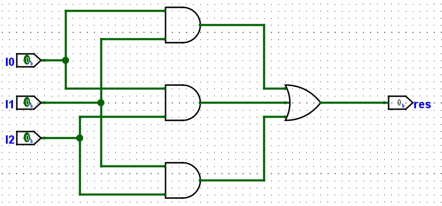

# 实验五 译码器

<!-- !!!danger "附件有效性"
    目前仍未对本实验附件进行测试，可能存在问题 -->

## 实验任务

1. 使用 Logisim 绘制译码器。
2. 使用 Vivado 对电路生成的 Verilog 代码进行仿真。
3. 使用 Vivado 综合并上板验证。

## 实验背景 {: #background}

### 二进制译码器

**译码器**(decoder)是一种负责将二进制输入转换为特定输出的组合逻辑电路，本次实验中讨论的主要是**二进制译码器**，它将每一个二进制输入与一个输出线对应，即每一种输入仅一条输出线为有效电平，其他输出线均为无效电平。

对于一个将 $N$ 个输入转换为 $2^N$ 个输出的译码器，我们以 **$N-2^N$ 译码器**为其命名，比如 3-8 译码器指的是将 3 位二进制输入转换为 8 个输出信号的译码器。

二进制译码器在数字系统中有很多应用场景，比如用于行列扫描或寻址（地址译码、键盘扫描）或组成复杂的控制逻辑。

### 低电平有效/高电平有效

**低电平有效**(Low-Level Active)，或称低电平触发，指的是在数字电路中，逻辑门或触发器的输入或控制信号在低电平（较低的电压值）时被视为有效或触发动作。高电平有效则与之相对。
在进行设计时，两者都是可行的选项。

### 74LS138 芯片

**74LS138** 芯片是一种 3-8 译码器芯片，用于将 3 位二进制地址输入信号转换为 8 个输出信号之一。主要端口为使能输入管脚 `G, G2A, G2B`，地址输入管脚 `A, B, C`（其中 `A` 为低地址），输出管脚 `Y0~Y7`。其真值表如下：  

  

#### 使能信号

74LS138 有三个使能信号 `G, G2A, G2B`，其中 `G` 信号为高电平有效的主要使能信号，当它处于低电位时，所有的输出信号均处于无效电位（高电位）。

`G2A, G2B` 是看起来有些冗余的使能信号，从真值表可以看出，它们为低电平有效，当两个信号**都为**低电平且 `G` 为高电平时，3-8 译码器能正常工作；当 `G2A` 与 `G2B` 中有一个为高电平时，输出均处于无效电平。  

这两个“冗余”的使能信号可以在实际应用中发挥作用，比如将 74LS138 用作**数据分配器**（或称多路分配器）时，可以将 `G2B` 置于低电平，这时地址信号对应的那个输出端口输出的电平将与 `G2A` 的电平相同。

同样的，当我们希望使用两个 74LS138 芯片组成一个 4-16 译码器时，也可以使用两个信号中的一个用于分配高一半地址与第一半地址，而保留 `G` 主使能信号的作用（如果仅有一个 `G` 使能信号，它将被用于区分高低地址，而使得到的电路需要添加额外的逻辑来实现主使能信号的作用）。  

#### 地址信号

我们约定 `A` 信号为最低位的地址信号，`C` 为最高位的地址信号，比如 `A, B, C` 信号值分别为 `0, 1, 1` 时，我们表达的地址为 `b110`，即对应选择 `Y6`。

## Logisim 基础操作-补充

本节将补充介绍几个 Logisim 的基本操作：修改电路名（对应 Verilog 代码中的 module 名）、分流器(Splitter)的使用以及自定义器件的使用。  

### 修改电路名

在新建一个 Logisim 项目时，它默认为项目名 Untitled，当前电路名 main，选中电路 main。在 Properties 中可以修改电路名(Circuit Name)。  

  

### 分流器

当一个信号有多条线，即**位宽**不为 1 时，我们可能需要分流器来将其**拆分**为多条线或从多个来源**汇集**。Logisim Wiring 库中提供了分流器，我们主要关注其 Properties 的含义，这里给出部分设置的解释：

* Facing 与 Appearance：器件朝向与形态，主要为了电路图美观，可根据实际情况自行调整。
* **Fan Out**：分流口数量，将原本的信号拆分成几份。
* **Bit Width In**：信号位宽。
* Bit 0/1/...：选择每一位分流所走的端口。

比如我们有一个 4 位地址信号 `addr`，希望将地址信号的低 2 位分流给 `a`，将高两位分别分流给 `b, c`。在设置时，因为 `addr` 线宽为 4，我们将 Bit Width In 设置为 4；因为分流给 `a, b, c` 三线需要三个分流端口，设置 Fan Out 为 3；随后将四个 bit 分配给合适的分流端口即可，得到的器件如下图：  

  

### 使用自定义器件

一个工程中可以有**多个电路**，我们可以单击 Add Circuit 来为当前的工程添加一个电路。

与 Vivado 中的 Top 模块类似，在 Logisim 中也可以右键电路选择 Set As Main Circuit，这主要影响我们导出为 Verilog 时的模块层级。

当一个工程中有多个电路时，我们可以在其中一个电路中使用另一个电路。**双击**进入我们希望编辑的电路，**单击**选择另一个电路，即可像使用库中的逻辑门一样使用这个电路组成新的逻辑。需要注意的是，如果你希望导出 Verilog，也需要为引入的模块进行命名。比如在完成了 `D_74LS138` 模块后，将其引入到新的电路中，并为其命名 `m0`，将在电路图中看到如下器件：

## 实现 74LS138

!!!tip "在开始本节前，请阅读[实验背景](#background)并理解译码器作用及74LS138 芯片的使能信号意义"

### 绘制电路图

新建 Logisim 工程，修改电路名为 `D_74LS138`。

以下为一种 74LS138 功能实现的电路图，你可以参考来完成电路图绘制，请确保端口名与下图一致：

!!!tip "建议"
    **推荐**你在画完图后使用 logisim 进行一些简单的仿真，确保线的连接没有严重问题。

绘图完成后，请获得 Verilog 代码，如果你忘记如何操作，请回看实验四的[实验指导](../warmup/lab4.md#logisim-export-verilog)。一切顺利的话，你将在 Logisim 工作目录对应工程文件夹的 `D_74LS138/verilog/` 下看到我们需要的 Verilog 代码。

### 仿真 {: simulation-74LS138}

使用 Vivado 新建工程，将 `D_74LS138/verilog/circuit/` 以及 `D_74LS138/verilog/gates/` 中的代码导入到工程中。使用[仿真文件](../attachment/D_74LS138_tb.v)对生成的 Verilog 代码进行仿真。

## D_74LS138 模块的简单应用

!!! abstract
    本节内容为使用刚刚完成的 `D_74LS138` 模块实现 Lab4 中的电路逻辑。
    
    我们将使用令一个简单的电路进行展示，请你在**浏览**本节内容后，完成[动手做](#simple-use_lets-do-it)小节的**另一个**电路的设计。

> 时常做客小杨家的三只小狗甲、乙、丙性格古怪，甲独处或者甲和乙共处一室都会闹个不停，但只要有丙在世界就会清静下来。请你设计一个电路，帮助小杨判断今天是不是平静的一天。

用 $A, B, C$ 分别表示甲、乙、丙今天是否前来；用 $P$ 表示结果，$P=1$ 意味着今天是平静的一天。很容易得到

$$
 P = \overline{(A + AB)\overline{C}} = \overline{A\overline{C}} = \overline{A} + C
$$

我们将上式转为**最小项**形式

$$
 P = \overline{A}BC + \overline{A}\ \overline{B}C + \overline{A}B\overline{C} + \overline{A}\ \overline{B}\ \overline{C} + ABC + A\overline{B}C
$$

在我们的实现中，输出端的“有效”为低电位 `0`，我们可将最小项的“或”取非变为“与非”，得到这个电路：

事实上，我们可以先关注 $\overline{P} = A\overline{C} = AB\overline{C} + A\overline{B}\ \overline{C}$，使用“与”门得到结果，即：

### 动手做 {: #simple-use_lets-do-it}

请你实现 Lab4 中“动手做”小节的电路逻辑，其电路图如下：

请你根据上个实验得到的真值表，写出其对应的**最小项**或**最大项**形式。

绘制电路图，你可以使用和 Lab4 中完全相同的电路名、端口名，这样你不需要对仿真文件和约束文件进行任何修改；或者使用其他电路名和端口名，并自行修改仿真文件和约束文件。绘制完成后，导出为 Verilog 文件。

使用上一节对 `D_74LS138` [仿真](#simulation-74LS138)时新建的工程或新建一个工程，将本节得到的代码文件导入到工程中。使用 Lab4 提供的[仿真文件](../../warmup/attachment/lab4_tb.v)进行仿真。确定器件仿真行为正常后，导入 Lab4 提供的[约束文件](../../warmup/attachment/constraints_lab4.xdc)，生成比特流并烧录到板上，查看现象。

## 实验报告要求

### 实现 74LS138

1. 绘制电路图后，截图 Logisim 界面。
2. 在 Vivado 中仿真，截图仿真界面，要求波形缩放合适，**并对波形进行解释**。

### 简单应用

1. 给出电路图真值表对应的最小项或最大项形式。
2. 绘制电路图后，截图 Logisim 界面。
3. 在 Vivado 中仿真，截图仿真界面，要求波形缩放合适。
4. 记录 8 种输入下，LED 的亮灭情况，选取一种情况拍摄即可。

### 思考题

请使用**两个** 74LS138 模块和尽可能简单的电路逻辑组成一个 **4-16** 译码器，给出电路图并进行解释。思考题不要求进行仿真等操作，手绘原理图、使用 Logisim 截图或 drawio 绘图工具等方式均可。